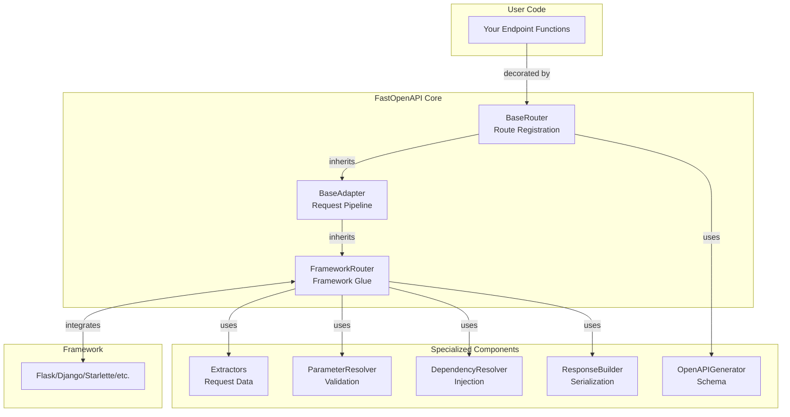
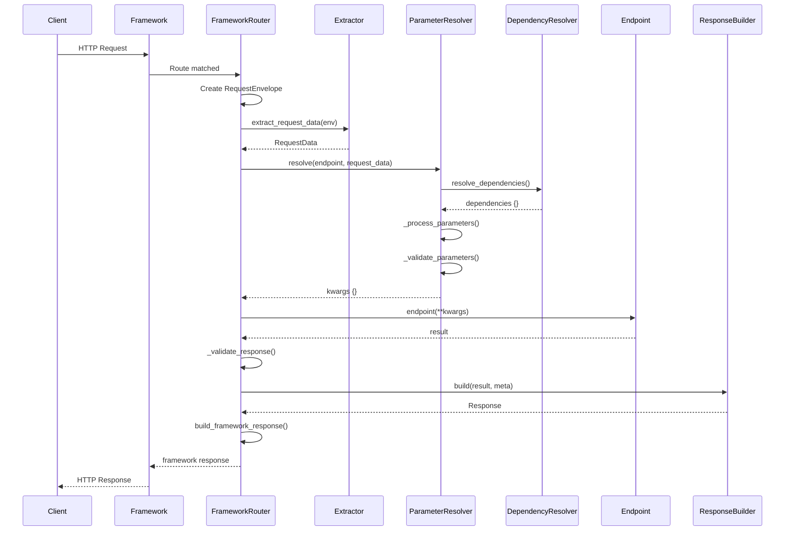
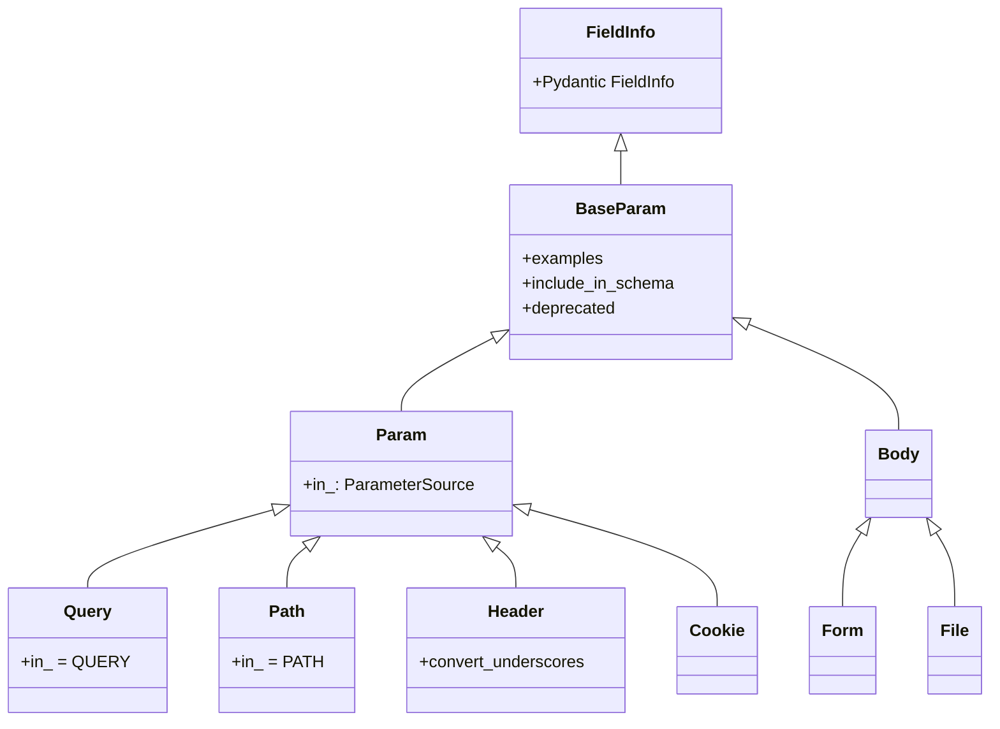
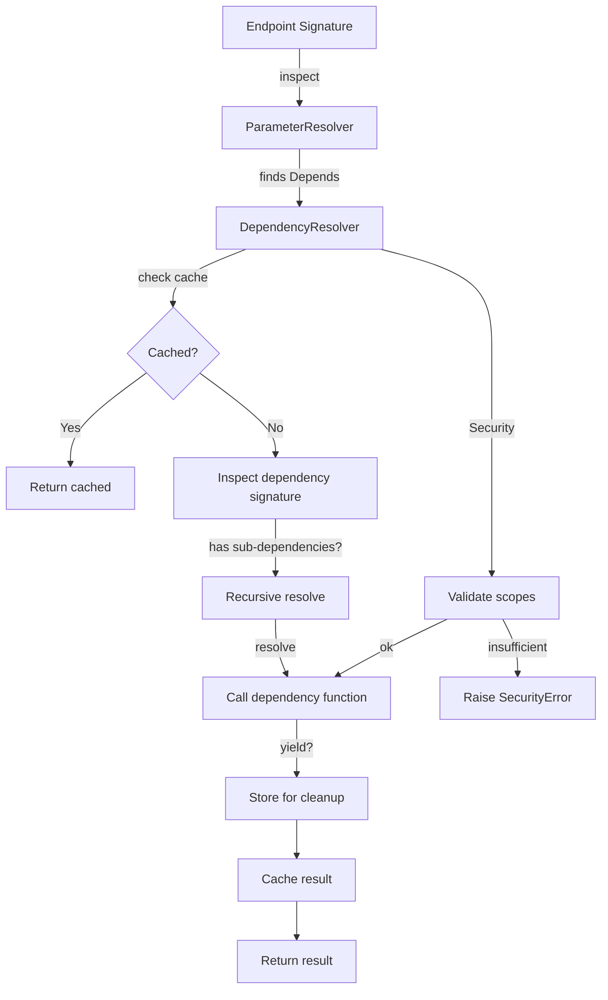
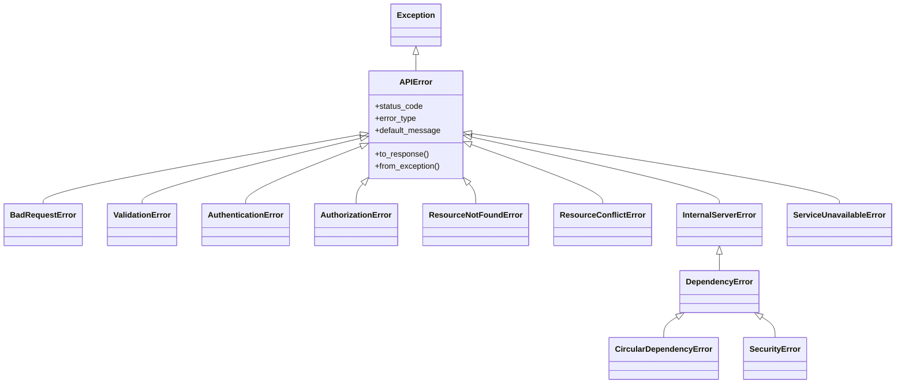

# Architecture

This document explains FastOpenAPI's internal architecture and design principles.

## Overview

FastOpenAPI is designed to be framework-agnostic while providing a FastAPI-like developer experience. It achieves this through a **composition-based adapter pattern** with clear separation of concerns.



## Core Design Pattern: Composition-Based Adapter

FastOpenAPI uses a three-tier architecture:

1. **BaseRouter** - Route registration and metadata storage
2. **BaseAdapter** - Request processing pipeline (using composition)
3. **FrameworkRouter** - Framework-specific integration

**Key Principle:** The router doesn't do the work itself—it delegates to specialized components through composition.

## Layer 1: BaseRouter

**Location:** `fastopenapi/core/router.py`

**Responsibilities:**
- Route registration via HTTP method decorators
- Metadata storage (`RouteInfo` objects)
- OpenAPI schema generation (lazy)
- Router composition (`include_router`)

```python
class BaseRouter:
    """Base router that collects routes and generates an OpenAPI schema"""

    def __init__(
        self,
        app=None,
        docs_url="/docs",
        redoc_url="/redoc",
        openapi_url="/openapi.json",
        title="My App",
        version="0.1.0",
        # ...
    ):
        self._routes: list[RouteInfo] = []
        self._openapi_schema = None  # Lazy generation

    def get(self, path: str, **meta):
        """Register GET endpoint"""
        return self._create_route_decorator(path, "GET", meta)

    def add_route(self, path: str, method: str, endpoint: Callable):
        """Store route metadata"""
        meta = getattr(endpoint, "__route_meta__", {})
        route = RouteInfo(path, method, endpoint, meta)
        self._routes.append(route)

    @property
    def openapi(self) -> dict:
        """Lazy OpenAPI schema generation"""
        if self._openapi_schema is None:
            from fastopenapi.openapi.generator import OpenAPIGenerator
            generator = OpenAPIGenerator(self)
            self._openapi_schema = generator.generate()
        return self._openapi_schema
```

**What BaseRouter DOES NOT do:**
- Does not extract request parameters
- Does not validate data
- Does not call endpoints
- Does not handle framework-specific logic

These responsibilities are delegated to `BaseAdapter` and specialized components.

## Layer 2: BaseAdapter

**Location:** `fastopenapi/routers/base.py`

**Responsibilities:**
- Orchestrate the request processing pipeline
- Delegate to specialized components via composition
- Provide framework integration interface

```python
class BaseAdapter(BaseRouter, ABC):
    """Base adapter for framework integration"""

    # Composition: Specialized components
    extractor_cls = BaseRequestDataExtractor
    extractor_async_cls = BaseAsyncRequestDataExtractor
    req_param_resolver_cls = ParameterResolver
    response_builder_cls = ResponseBuilder

    # Thread-safe caches
    _type_adapter_cache: dict[type, TypeAdapter] = {}
    _cache_lock = threading.Lock()

    @abstractmethod
    def build_framework_response(self, response: Response):
        """Convert Response to framework-specific response"""
        pass

    @abstractmethod
    def is_framework_response(self, response):
        """Check if response is already framework-native"""
        pass

    def handle_request(self, endpoint: Callable, env: RequestEnvelope):
        """Orchestrate request processing (sync)"""
        try:
            # 1. Extract request data
            request_data = self.extractor_cls.extract_request_data(env)

            # 2. Resolve parameters
            kwargs = self.req_param_resolver_cls.resolve(endpoint, request_data)

            # 3. Call endpoint
            result = endpoint(**kwargs)

            # 4. Validate response
            route_meta = endpoint.__route_meta__
            response_model = route_meta.get("response_model")
            if response_model:
                result = self._validate_response(result, response_model)

            # 5. Handle framework-native responses
            if self.is_framework_response(result):
                return result

            # 6. Build response
            if route_meta.get("status_code") == 204:
                return self.build_framework_response(
                    Response(status_code=204, content=None)
                )
            else:
                response = self.response_builder_cls.build(result, route_meta)
                return self.build_framework_response(response)

        except Exception as e:
            api_error = APIError.from_exception(e, self.EXCEPTION_MAPPER)
            return self.build_framework_response(
                Response(
                    content=api_error.to_response(),
                    status_code=api_error.status_code,
                )
            )
```

**Key Features:**
- **Composition over inheritance** - Uses specialized component classes
- **Thread-safe caching** - TypeAdapter cache with lock
- **Error handling** - Converts all exceptions to APIError
- **Async support** - Separate `handle_request_async` method

## Layer 3: FrameworkRouter

**Example:** `fastopenapi/routers/starlette/async_router.py`

**Responsibilities:**
- Implement three abstract methods from `BaseAdapter`
- Register routes with the framework
- Adapt framework requests to `RequestEnvelope`

```python
class StarletteRouter(BaseAdapter):
    """Starlette adapter for FastOpenAPI"""

    extractor_async_cls = StarletteRequestDataExtractor

    def add_route(self, path: str, method: str, endpoint: Callable):
        """Register route with Starlette"""
        super().add_route(path, method, endpoint)

        # Create view function
        view = functools.partial(
            self._starlette_view,
            router=self,
            endpoint=endpoint
        )

        # Register with Starlette
        route = Route(path, view, methods=[method.upper()])
        self.app.router.routes.append(route)

    @staticmethod
    async def _starlette_view(request, router, endpoint):
        """Adapt Starlette request to RequestEnvelope"""
        env = RequestEnvelope(path_params=None, request=request)
        return await router.handle_request_async(endpoint, env)

    def build_framework_response(self, response: Response):
        """Convert Response to StarletteResponse"""
        if isinstance(response.content, bytes):
            return StarletteResponse(
                content=response.content,
                status_code=response.status_code,
                headers=response.headers,
                media_type=response.headers.get("Content-Type", "application/octet-stream"),
            )
        # ... handle JSON, text, etc.

    def is_framework_response(self, response):
        """Check if already a Starlette response"""
        return isinstance(response, StarletteResponse)
```

**That's it!** Just three methods to integrate a new framework.

## Specialized Components

### 1. Request Data Extractors

**Location:** `fastopenapi/routers/extractors.py` and `fastopenapi/routers/{framework}/extractors.py`

**Responsibility:** Extract raw data from framework-specific request objects into a unified `RequestData` container.

```python
class RequestData:
    """Unified request data container"""
    def __init__(
        self,
        path_params: dict[str, Any],
        query_params: dict[str, Any],
        headers: dict[str, str],
        cookies: dict[str, str],
        body: dict[str, Any] | None = None,
        form_data: dict[str, Any] | None = None,
        files: dict[str, Any] | None = None,
    ):
        self.path_params = path_params
        self.query_params = query_params
        self.headers = headers
        self.cookies = cookies
        self.body = body
        self.form_data = form_data
        self.files = files
```

**Extractor Interface:**

```python
class BaseAsyncRequestDataExtractor(BaseRequestDataExtractor, ABC):
    """Base async extractor — overrides only body/form/files as async"""

    @classmethod
    @abstractmethod
    async def _get_body(cls, request: Any) -> bytes | str | dict: ...

    @classmethod
    @abstractmethod
    async def _get_form_data(cls, request: Any) -> dict: ...

    @classmethod
    @abstractmethod
    async def _get_files(cls, request: Any) -> dict: ...

    @classmethod
    async def extract_request_data(cls, env: RequestEnvelope) -> RequestData:
        request = env.request
        return RequestData(
            path_params=env.path_params or cls._get_path_params(request),
            query_params=cls._get_query_params(request),          # sync
            headers=cls._normalize_headers(cls._get_headers(request)),  # sync
            cookies=cls._get_cookies(request),                    # sync
            body=await cls._get_body(request),                    # async
            form_data=await cls._get_form_data(request),          # async
            files=await cls._get_files(request),                  # async
        )
```

> **Note:** `_get_path_params`, `_get_query_params`, `_get_headers`, `_get_cookies` are **synchronous** methods inherited from `BaseRequestDataExtractor`. Only `_get_body`, `_get_form_data`, and `_get_files` are overridden as async. All `_get_*` methods receive the framework `request` object, not the `RequestEnvelope`.

Each framework provides its own extractor (e.g., `StarletteRequestDataExtractor`, `FlaskRequestDataExtractor`).

### 2. Parameter Resolver

**Location:** `fastopenapi/resolution/resolver.py`

**Responsibility:** Resolve and validate endpoint parameters using Pydantic.

```python
class ParameterResolver:
    """Resolve and validate endpoint parameters"""

    @classmethod
    def resolve(cls, endpoint: Callable, request_data: RequestData) -> dict[str, Any]:
        """Resolve all parameters for an endpoint"""
        params = cls._get_signature(endpoint)
        kwargs = {}

        # 1. Resolve dependencies
        kwargs.update(cls._resolve_dependencies(endpoint, request_data))

        # 2. Process regular parameters
        regular_kwargs, model_fields, model_values = cls._process_parameters(
            params, request_data
        )
        kwargs.update(regular_kwargs)

        # 3. Validate parameters using dynamic Pydantic model
        if model_fields:
            validated_params = cls._validate_parameters(
                endpoint, model_fields, model_values
            )
            kwargs.update(validated_params)

        return kwargs
```

**Key Features:**
- **Signature caching** - Caches `inspect.signature()` results
- **Dynamic Pydantic models** - Creates models on-the-fly for validation
- **Source determination** - Figures out if parameter comes from path/query/body/etc.
- **Pydantic model support** - Handles `BaseModel` parameters specially

### 3. Dependency Resolver

**Location:** `fastopenapi/core/dependency_resolver.py`

**Responsibility:** Recursive dependency injection with caching and validation.

```python
class DependencyResolver:
    """
    Resolves dependency injection with:
    - Recursive resolution
    - Request-scoped caching
    - Circular dependency detection
    - Security scopes validation
    - Thread-safe operation
    """

    def __init__(self):
        # Request-scoped cache (auto-cleanup with WeakKeyDictionary)
        self._request_cache = WeakKeyDictionary()
        self._request_cache_lock = threading.RLock()

        # Per-function locks to prevent race conditions
        self._execution_locks: dict[int, threading.Lock] = {}
        self._execution_locks_lock = threading.Lock()

        # Signature cache
        self._signature_cache: dict[Callable, dict] = {}

    def resolve_dependencies(
        self,
        endpoint: Callable,
        request_data: RequestData
    ) -> dict[str, Any]:
        """Resolve all dependencies for endpoint"""
        # Initialize request-scoped tracking
        with self._request_cache_lock:
            if request_data not in self._request_cache:
                self._request_cache[request_data] = {
                    "resolved": {},
                    "resolving": set(),  # For circular detection
                    "generators": [],  # For yield dependency cleanup
                }

        try:
            return self._resolve_endpoint_dependencies(endpoint, request_data)
        finally:
            # Cleanup
            with self._request_cache_lock:
                if request_data in self._request_cache:
                    del self._request_cache[request_data]
```

**Key Features:**
- **Request-scoped caching** - Same dependency called twice = same instance
- **Circular dependency detection** - Raises `CircularDependencyError`
- **Security scopes validation** - Validates OAuth2 scopes
- **Generator dependencies** - Supports `yield` setup/teardown for both sync and async generators with guaranteed cleanup
- **Thread-safe** - Double-checked locking pattern
- **Async support** - Separate async methods that handle both sync and async deps

### 4. Response Builder (Serialization)

**Location:** `fastopenapi/response/builder.py`

**Responsibility:** Serialize Python objects to JSON and build response objects.

**Note:** This is different from `ResponseBuilder` in `fastopenapi/openapi/generator.py`, which builds OpenAPI response schemas for documentation. They share the same class name but serve different purposes.

```python
class ResponseBuilder:
    """Build and serialize responses"""

    @classmethod
    def build(cls, result: Any, meta: dict) -> Response:
        """Build response from endpoint result"""
        # Handle tuple response (body, status, headers)
        if isinstance(result, tuple):
            if len(result) == 2:
                content, status = result
                headers = {}
            elif len(result) == 3:
                content, status, headers = result
            else:
                content = result
                status = meta.get("status_code", 200)
                headers = {}
        # Handle Response object
        elif isinstance(result, Response):
            return result
        # Handle regular response
        else:
            content = result
            status = meta.get("status_code", 200)
            headers = {}

        # Serialize content
        content = cls._serialize(content)
        return Response(content=content, status_code=status, headers=headers)

    @classmethod
    def _serialize(cls, data: Any) -> Any:
        """Serialize response data"""
        if isinstance(data, BaseModel):
            return data.model_dump(by_alias=True, mode="json")
        if isinstance(data, list):
            return [cls._serialize(item) for item in data]
        if isinstance(data, dict):
            return {k: cls._serialize(v) for k, v in data.items()}
        return data
```

### 5. OpenAPI Generator

**Location:** `fastopenapi/openapi/generator.py`

**Responsibility:** Generate OpenAPI 3.0 schema from route metadata.

```python
class OpenAPIGenerator:
    """Generate OpenAPI schema from routes"""

    def __init__(self, router):
        self.router = router
        self.definitions = {}
        self._cache_lock = threading.Lock()

        # Helper classes (composition!)
        self.schema_builder = SchemaBuilder(self.definitions, self._cache_lock)
        self.parameter_processor = ParameterProcessor(self.schema_builder)
        self.response_builder = ResponseBuilder(self.schema_builder)  # OpenAPI schema builder, not the serialization ResponseBuilder

    def generate(self) -> dict:
        """Generate complete OpenAPI schema"""
        self._add_error_schemas()
        paths = self._build_paths()

        schema = {
            "openapi": self.router.openapi_version,
            "info": {
                "title": self.router.title,
                "version": self.router.version,
                "description": self.router.description,
            },
            "paths": paths,
            "components": {"schemas": self.definitions},
        }

        self._add_security_schemes(schema)
        self._add_global_security(schema)

        return schema
```

**Key Features:**
- **Lazy generation** - Only generated when `.openapi` property accessed
- **Thread-safe caching** - Model schemas cached with lock
- **Pydantic integration** - Uses `model_json_schema()`
- **Security markers** - Detects `Security()` dependencies for OpenAPI security requirements

## Request Processing Flow



### Detailed Flow Steps:

1. **Framework receives request** - Routes to registered handler
2. **FrameworkRouter creates RequestEnvelope** - Wraps framework request
3. **Extractor extracts data** - Framework-agnostic `RequestData`
4. **ParameterResolver resolves parameters**:
   - Calls `DependencyResolver` for `Depends()` parameters
   - Extracts parameters from `RequestData` based on source (path/query/etc.)
   - Creates dynamic Pydantic model for validation
   - Returns validated kwargs
5. **Endpoint is called** - With resolved kwargs
6. **Response validation** - If `response_model` specified
7. **ResponseBuilder builds response** - Serializes to JSON
8. **Framework response built** - Converts to framework-specific response

## Parameter System

**Location:** `fastopenapi/core/params.py`

FastOpenAPI parameters extend Pydantic's `FieldInfo`:

```python
class BaseParam(FieldInfo):
    """Base parameter class extending Pydantic FieldInfo"""

    def __init__(
        self,
        default=...,
        *,
        alias=None,
        title=None,
        description=None,
        gt=None,  # Greater than
        ge=None,  # Greater or equal
        lt=None,  # Less than
        le=None,  # Less or equal
        min_length=None,
        max_length=None,
        pattern=None,
        # ... and more Pydantic constraints
    ):
        # Passes everything to Pydantic FieldInfo
        super().__init__(...)
```

**Parameter Hierarchy:**



## Dependency Injection System



**Features:**

1. **Request-Scoped Caching:**
   ```python
   def get_db():
       print("Creating DB")  # Printed once per request
       yield SessionLocal()

   @router.get("/users/{user_id}")
   def get_user(
       db1: Session = Depends(get_db),  # Same instance
       db2: Session = Depends(get_db),  # Same instance
   ):
       assert db1 is db2  # True!
   ```

2. **Circular Dependency Detection:**
   ```python
   def dep_a(b = Depends(dep_b)):
       return b

   def dep_b(a = Depends(dep_a)):
       return a

   # Raises: CircularDependencyError
   ```

3. **Security Scopes:**
   ```python
   def verify_token():
       return {"user": "john", "scopes": ["read", "write"]}

   @router.get("/admin")
   def admin_only(user = Security(verify_token, scopes=["admin"])):
       # SecurityError if "admin" not in user["scopes"]
       return user
   ```

4. **Generator Cleanup:**
   ```python
   def get_db():
       db = connect()
       try:
           yield db  # Injected value
       finally:
           db.close()  # Always called after request
   ```

## Error Handling

**Location:** `fastopenapi/errors/exceptions.py`



**Key Feature - Smart Exception Conversion:**

```python
@classmethod
def from_exception(cls, exc, mapper=None):
    """Convert any exception to APIError"""
    if isinstance(exc, APIError):
        return exc

    # Try custom mapper
    if mapper and type(exc) in mapper:
        return mapper[type(exc)](str(exc))

    # Extract status code
    for attr in ("status_code", "code"):
        if hasattr(exc, attr):
            status = HTTPStatus(int(getattr(exc, attr)))
            break

    # Extract message
    for attr in ("message", "title", "name", "reason", "detail"):
        if hasattr(exc, attr):
            message = str(getattr(exc, attr))
            break

    # Create APIError
    api_error = APIError(message=message)
    api_error.status_code = status
    return api_error
```

This allows framework-specific exceptions to be automatically converted to standardized API errors.

## Performance Optimizations

### 1. Lazy OpenAPI Generation

Schema generated only when `.openapi` property accessed:

```python
@property
def openapi(self) -> dict:
    if self._openapi_schema is None:
        generator = OpenAPIGenerator(self)
        self._openapi_schema = generator.generate()
    return self._openapi_schema
```

### 2. TypeAdapter Caching

Pydantic TypeAdapters are cached with thread-safe double-checked locking:

```python
_type_adapter_cache: dict[type, TypeAdapter] = {}
_cache_lock = threading.Lock()

@classmethod
def _get_type_adapter(cls, resp_model):
    if resp_model not in cls._type_adapter_cache:
        with cls._cache_lock:
            if resp_model not in cls._type_adapter_cache:
                cls._type_adapter_cache[resp_model] = TypeAdapter(resp_model)
    return cls._type_adapter_cache[resp_model]
```

### 3. Signature Caching

Function signatures cached to avoid repeated `inspect.signature()` calls:

```python
_signature_cache: dict[Callable, MappingProxyType] = {}

@classmethod
def _get_signature(cls, endpoint):
    if endpoint not in cls._signature_cache:
        sig = inspect.signature(endpoint)
        cls._signature_cache[endpoint] = sig.parameters
    return cls._signature_cache[endpoint]
```

### 4. Dynamic Model Caching

Pydantic validation models cached per endpoint:

```python
_param_model_cache: dict[frozenset, type[BaseModel]] = {}

@classmethod
def _get_or_create_validation_model(cls, endpoint, model_fields):
    cache_key = frozenset(
        (endpoint.__module__, endpoint.__name__, name, str(field_info))
        for name, field_info in model_fields.items()
    )

    if cache_key not in cls._param_model_cache:
        cls._param_model_cache[cache_key] = create_model(
            "ParamsModel",
            __base__=_ParamsBase,
            **model_fields,
        )

    return cls._param_model_cache[cache_key]
```

### 5. Request-Scoped Dependency Caching

Dependencies cached per request using `WeakKeyDictionary` for automatic cleanup:

```python
self._request_cache = WeakKeyDictionary()

# Cache keyed by (dependency_id, request_data_id)
cache_key = (id(dependency_func), id(request_data))
```

## Design Principles

### 1. Framework Agnostic

Core logic is independent of any specific framework. Framework-specific code is isolated in:
- Router classes (3 methods to implement)
- Extractor classes (extract data from framework request)

### 2. Composition Over Inheritance

Instead of a monolithic router, FastOpenAPI uses specialized components:
- `Extractors` extract data
- `ParameterResolver` validates parameters
- `DependencyResolver` handles injection
- `ResponseBuilder` serializes responses
- `OpenAPIGenerator` creates schemas

This makes each component:
- Easier to test in isolation
- Easier to replace or customize
- Easier to understand
- More maintainable

### 3. Type Safety

- Full type hints throughout
- Pydantic v2 for validation
- TypeAdapter for response validation

### 4. Thread Safety

- All caches use locks
- Request-scoped caching with `WeakKeyDictionary`
- Per-function locks in dependency resolver
- Double-checked locking pattern

### 5. Performance

- Lazy schema generation
- Multiple layers of caching
- Minimal overhead over native framework
- Pydantic v2's optimized validation

### 6. Minimal Dependencies

Core only requires Pydantic v2. Framework-specific dependencies are optional.

## Adding a New Framework

To add support for a new framework, you need:

### 1. Create Extractor Class

```python
# fastopenapi/routers/myframework/extractors.py

from fastopenapi.routers.extractors import BaseAsyncRequestDataExtractor
from fastopenapi.core.types import RequestData
from fastopenapi.routers.common import RequestEnvelope

class MyFrameworkExtractor(BaseAsyncRequestDataExtractor):

    @classmethod
    async def _get_path_params(cls, env: RequestEnvelope) -> dict:
        request = env.request
        return request.path_params  # Framework-specific

    @classmethod
    async def _get_query_params(cls, env: RequestEnvelope) -> dict:
        request = env.request
        return dict(request.query_params)  # Framework-specific

    # Implement other _get_* methods...
```

### 2. Create Router Class

```python
# fastopenapi/routers/myframework/async_router.py

from fastopenapi.routers.base import BaseAdapter
from fastopenapi.routers.common import RequestEnvelope
from fastopenapi.core.types import Response
from .extractors import MyFrameworkExtractor

class MyFrameworkRouter(BaseAdapter):
    """MyFramework adapter for FastOpenAPI"""

    extractor_async_cls = MyFrameworkExtractor

    def add_route(self, path: str, method: str, endpoint: Callable):
        """Register route with MyFramework"""
        super().add_route(path, method, endpoint)

        # Create wrapper
        async def view(request):
            env = RequestEnvelope(path_params=None, request=request)
            return await self.handle_request_async(endpoint, env)

        # Register with framework
        self.app.add_route(path, view, methods=[method])

    def build_framework_response(self, response: Response):
        """Convert Response to MyFrameworkResponse"""
        return MyFrameworkResponse(
            content=response.content,
            status=response.status_code,
            headers=response.headers,
        )

    def is_framework_response(self, response):
        """Check if already a framework response"""
        return isinstance(response, MyFrameworkResponse)
```

### 3. Register in `__init__.py`

```python
# fastopenapi/routers/__init__.py

from .myframework.async_router import MyFrameworkRouter

__all__ = [
    # ... other routers
    "MyFrameworkRouter",
]
```

### 4. Add Tests

```python
# tests/routers/myframework/test_myframework_router.py

def test_get_endpoint(client):
    response = client.get("/test")
    assert response.status_code == 200

def test_parameter_extraction(client):
    response = client.get("/users/123")
    assert response.json() == {"user_id": 123}

# ... more tests
```

That's it! Three classes and you've integrated a new framework.

## Testing Architecture

FastOpenAPI has comprehensive tests:

```
tests/
├── core/                           # Core functionality
│   ├── test_base_router.py
│   ├── test_dependency_resolver.py
│   ├── test_params.py
│   └── test_types.py
├── resolution/                     # Parameter resolution
│   └── test_parameter_resolver.py
├── response/                       # Response building
│   └── test_response_builder.py
├── openapi/                        # Schema generation
│   ├── test_openapi_generator.py
│   └── test_ui.py
└── routers/                        # Framework adapters
    ├── aiohttp/
    ├── django/
    ├── falcon/
    ├── flask/
    ├── quart/
    ├── sanic/
    ├── starlette/
    └── tornado/
        ├── test_{framework}_router.py
        ├── test_{framework}_extractor.py
        └── test_{framework}_integration.py
```

Each framework has:
- Router tests
- Extractor tests
- Integration tests

## Architecture Decisions

### Why Composition?

**Instead of:**
```python
class BaseRouter:
    def extract_parameters(self, ...):
        # 500 lines

    def validate_parameters(self, ...):
        # 300 lines

    def resolve_dependencies(self, ...):
        # 400 lines

    # ... 2000 lines total
```

**We use:**
```python
class BaseAdapter:
    extractor_cls = Extractor          # ~200 lines
    resolver_cls = ParameterResolver   # ~500 lines
    dependency_cls = DependencyResolver # ~600 lines
    builder_cls = ResponseBuilder      # ~100 lines
```

**Benefits:**
- Each component has one responsibility
- Easy to test in isolation
- Easy to customize (just swap the class)
- No god objects
- Clear dependencies

### Why Three-Tier Inheritance?

1. **BaseRouter** - Framework-agnostic route registration
2. **BaseAdapter** - Framework-agnostic request pipeline
3. **FrameworkRouter** - Framework-specific glue (just 3 methods!)

This separation means:
- Core logic never touches framework code
- Framework adapters are thin (50-150 lines)
- Easy to add new frameworks
- Easy to maintain

### Why WeakKeyDictionary?

```python
self._request_cache = WeakKeyDictionary()
```

- Automatic cleanup when request is garbage collected
- No manual cache clearing needed
- No memory leaks
- Thread-safe with RLock

### Why Double-Checked Locking?

```python
if key not in cache:  # First check (fast path)
    with lock:
        if key not in cache:  # Second check (slow path)
            cache[key] = expensive_operation()
```

- Fast path avoids lock for cache hits
- Slow path ensures thread safety
- Prevents duplicate work in multi-threaded environments

## Next Steps

- [Custom Routers](custom_routers.md) - Build custom routers
- [OpenAPI Customization](openapi_customization.md) - Customize schemas
- [Testing](testing.md) - Testing your API
- [Performance](performance.md) - Optimization tips
