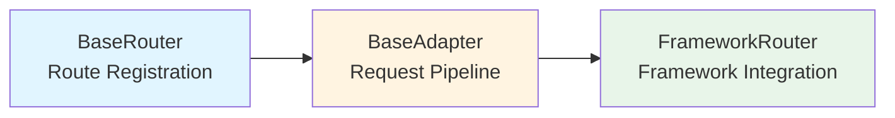
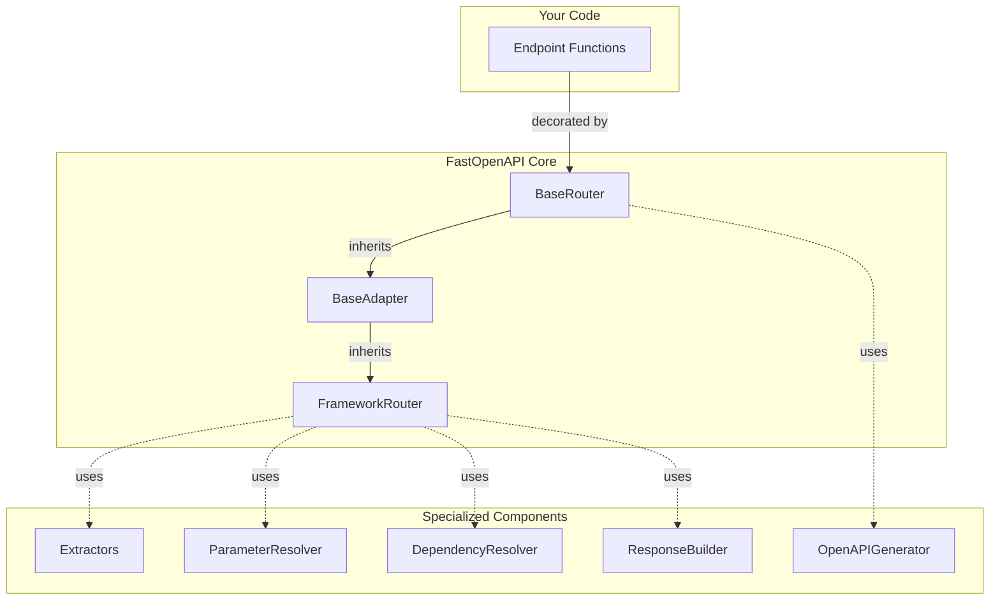
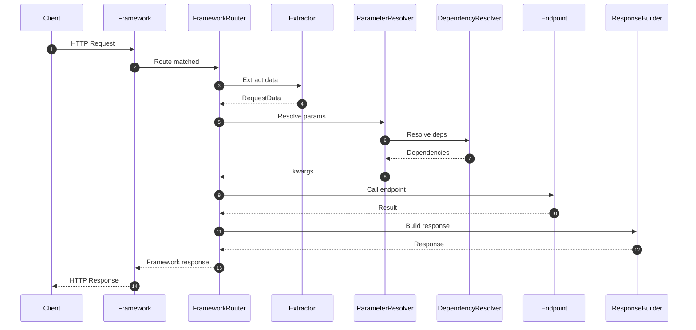
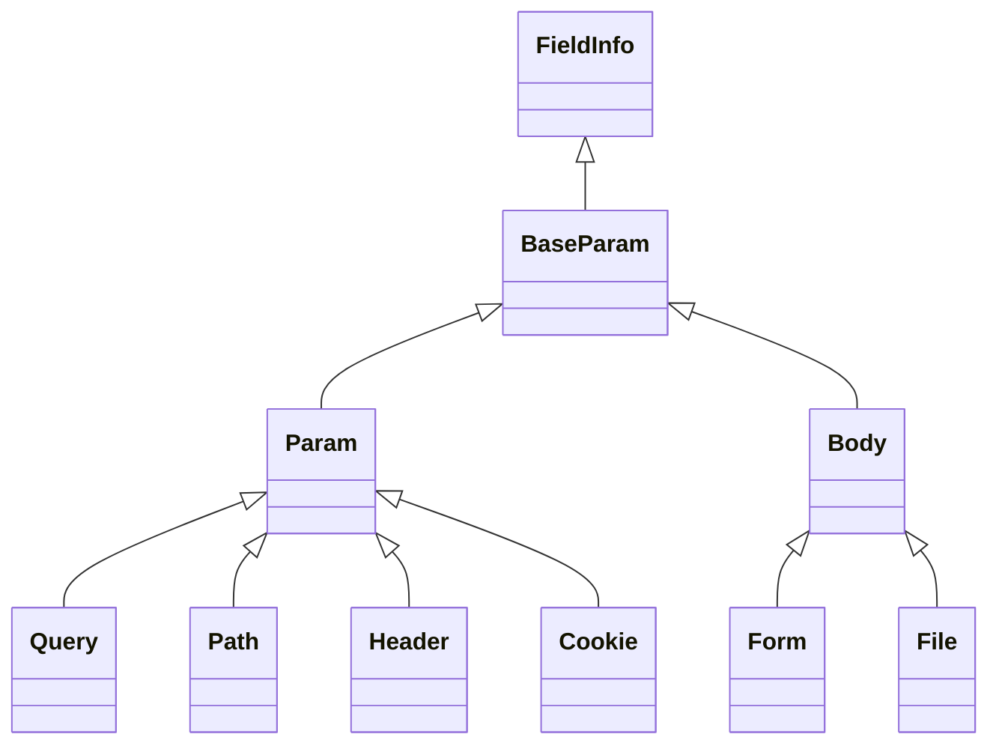
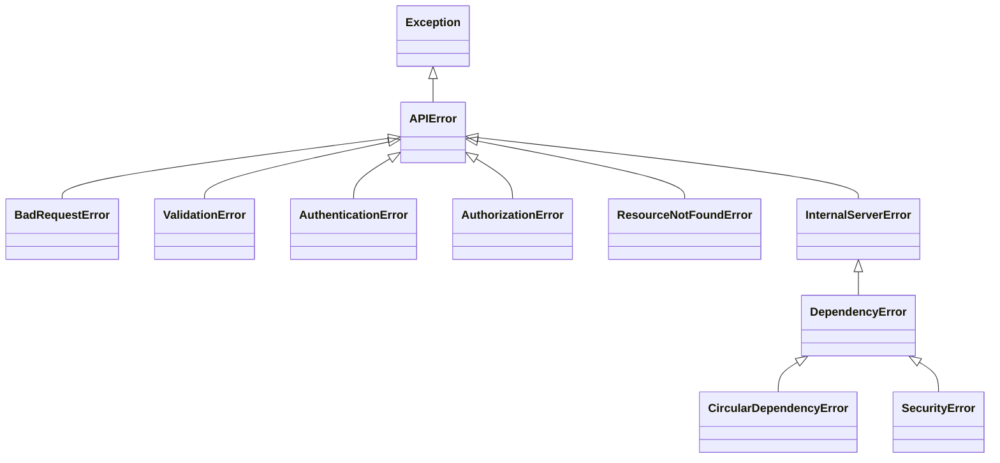
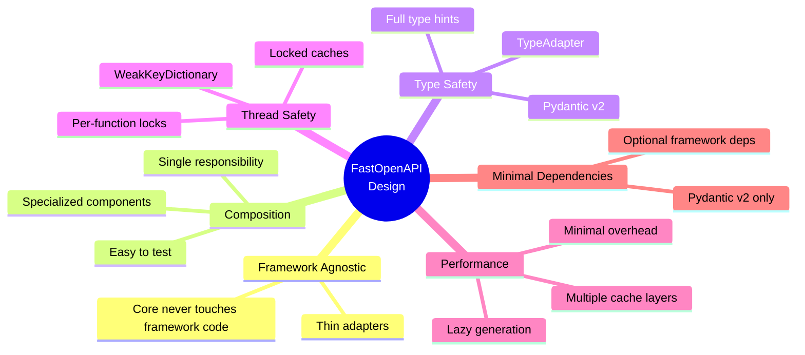

# Architecture Quick Reference

This is a quick visual reference for FastOpenAPI's architecture. For detailed explanation, see [Architecture](architecture.md).

## Three-Tier Design

## Component Composition

## Request Flow

## Key Classes

| Class | Location | Responsibility |
|-------|----------|----------------|
| `BaseRouter` | `fastopenapi/core/router.py` | Route registration, OpenAPI generation |
| `BaseAdapter` | `fastopenapi/routers/base.py` | Request pipeline orchestration |
| `FrameworkRouter` | `fastopenapi/routers/{framework}/` | Framework integration (3 methods) |
| `BaseRequestDataExtractor` / `BaseAsyncRequestDataExtractor` | `fastopenapi/routers/extractors.py` | Extract data from requests (sync / async) |
| `ParameterResolver` | `fastopenapi/resolution/resolver.py` | Parameter validation |
| `DependencyResolver` | `fastopenapi/core/dependency_resolver.py` | Dependency injection |
| `ResponseBuilder` | `fastopenapi/response/builder.py` | Response serialization |
| `OpenAPIGenerator` | `fastopenapi/openapi/generator.py` | Schema generation |

## Adding a Framework: Checklist

To add a new framework, implement:

- [ ] **Extractor class** - Extract data from framework request
  - Inherit from `BaseAsyncRequestDataExtractor` or `BaseRequestDataExtractor`
  - Implement `_get_*` methods (`_get_path_params`, `_get_query_params`, `_get_headers`, `_get_cookies`, `_get_body`, `_get_form_data`, `_get_files`)

- [ ] **Router class** - Integrate with framework
  - Inherit from `BaseAdapter`
  - Set `extractor_cls` or `extractor_async_cls`
  - Implement `add_route()`
  - Implement `build_framework_response()`
  - Implement `is_framework_response()`

- [ ] **Tests** - Comprehensive test suite
  - Router tests
  - Extractor tests
  - Integration tests

That's it! Just 2-3 classes.

## Parameter Hierarchy

## Error Hierarchy

## Caching Strategy

| Cache | Type | Key | Cleanup | Purpose |
|-------|------|-----|---------|---------|
| TypeAdapter | Class-level | Model type | Never | Response validation |
| Signature | Class-level | Function | Never | Parameter inspection |
| Param Model | Class-level | Fields hash | Never | Validation models |
| Dependency | Request-scoped | (func, request) | Automatic (WeakKeyDictionary) | DI results |
| OpenAPI Schema | Instance-level | N/A | Never | Schema generation |

## Performance Optimizations

1. **Lazy OpenAPI Generation** - Schema only generated when accessed
2. **TypeAdapter Caching** - Pydantic adapters cached with thread-safe locking
3. **Signature Caching** - Function signatures cached
4. **Dynamic Model Caching** - Validation models cached per endpoint
5. **Request-Scoped Caching** - Dependencies cached per request
6. **Double-Checked Locking** - Fast path avoids locks for cache hits

## Design Principles

## Next Steps

- [Full Architecture Documentation](architecture.md) - Detailed explanation
- [Custom Routers](custom_routers.md) - Build custom framework adapters
- [OpenAPI Customization](openapi_customization.md) - Customize schemas
- [Testing](testing.md) - Testing strategies
- [Performance](performance.md) - Optimization tips
