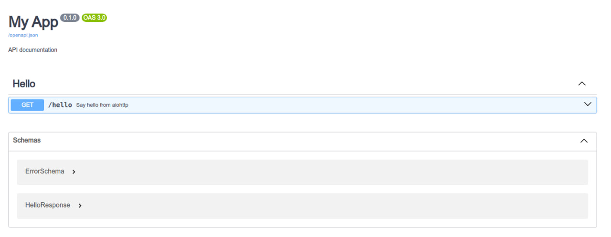
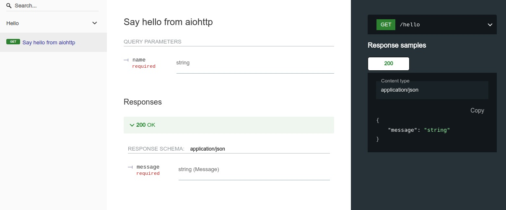

# Быстрый старт

Этот гайд поможет вам добавить FastOpenAPI в простое приложение и просмотреть автоматически сгенерированную документацию API.

### Шаг 0. Установите библиотеку  
Следуйте инструкции из [Установка](installation.md)

### Шаг 1. Создайте приложение

- Создайте файл `main.py`
- Скопируйте код из подходящего примера
- Для некоторых примеров требуется uvicorn (`pip install uvicorn`)

#### Примеры

##### AioHTTP
<details>
<summary>Нажмите, чтобы развернуть пример AioHttp</summary>

```python
from aiohttp import web
from pydantic import BaseModel

from fastopenapi.routers import AioHttpRouter

app = web.Application()
router = AioHttpRouter(app=app)


class HelloResponse(BaseModel):
    message: str


@router.get("/hello", tags=["Hello"], status_code=200, response_model=HelloResponse)
async def hello(name: str):
    """Say hello from aiohttp"""
    return HelloResponse(message=f"Hello, {name}! It's aiohttp!")


if __name__ == "__main__":
    web.run_app(app, host="127.0.0.1", port=8000)
```
</details>

##### Falcon
<details>
<summary>Нажмите, чтобы развернуть пример Falcon</summary>

```python
import falcon.asgi
import uvicorn
from pydantic import BaseModel

from fastopenapi.routers import FalconRouter

app = falcon.asgi.App()
router = FalconRouter(app=app)


class HelloResponse(BaseModel):
    message: str


@router.get("/hello", tags=["Hello"], status_code=200, response_model=HelloResponse)
async def hello(name: str):
    """Say hello from Falcon"""
    return HelloResponse(message=f"Hello, {name}! It's Falcon!")


if __name__ == "__main__":
    uvicorn.run(app, host="127.0.0.1", port=8000)
```
</details>

##### Flask
<details>
<summary>Нажмите, чтобы развернуть пример Flask</summary>

```python
from flask import Flask
from pydantic import BaseModel

from fastopenapi.routers import FlaskRouter

app = Flask(__name__)
router = FlaskRouter(app=app)


class HelloResponse(BaseModel):
    message: str


@router.get("/hello", tags=["Hello"], status_code=200, response_model=HelloResponse)
def hello(name: str):
    """Say hello from Flask"""
    return HelloResponse(message=f"Hello, {name}! It's Flask!")


if __name__ == "__main__":
    app.run(port=8000)
```
</details>

##### Quart
<details>
<summary>Нажмите, чтобы развернуть пример Quart</summary>

```python
from pydantic import BaseModel
from quart import Quart

from fastopenapi.routers import QuartRouter

app = Quart(__name__)
router = QuartRouter(app=app)


class HelloResponse(BaseModel):
    message: str


@router.get("/hello", tags=["Hello"], status_code=200, response_model=HelloResponse)
async def hello(name: str):
    """Say hello from Quart"""
    return HelloResponse(message=f"Hello, {name}! It's Quart!")


if __name__ == "__main__":
    app.run(port=8000)
```
</details>

##### Sanic
<details>
<summary>Нажмите, чтобы развернуть пример Sanic</summary>

```python
from pydantic import BaseModel
from sanic import Sanic

from fastopenapi.routers import SanicRouter

app = Sanic("MySanicApp")
router = SanicRouter(app=app)


class HelloResponse(BaseModel):
    message: str


@router.get("/hello", tags=["Hello"], status_code=200, response_model=HelloResponse)
async def hello(name: str):
    """Say hello from Sanic"""
    return HelloResponse(message=f"Hello, {name}! It's Sanic!")


if __name__ == "__main__":
    app.run(host="0.0.0.0", port=8000)
```
</details>

##### Starlette
<details>
<summary>Нажмите, чтобы развернуть пример Starlette</summary>

```python
import uvicorn
from pydantic import BaseModel
from starlette.applications import Starlette

from fastopenapi.routers import StarletteRouter

app = Starlette()
router = StarletteRouter(app=app)


class HelloResponse(BaseModel):
    message: str


@router.get("/hello", tags=["Hello"], status_code=200, response_model=HelloResponse)
async def hello(name: str):
    """Say hello from Starlette"""
    return HelloResponse(message=f"Hello, {name}! It's Starlette!")


if __name__ == "__main__":
    uvicorn.run(app, host="127.0.0.1", port=8000)
```
</details>

##### Tornado
<details>
<summary>Нажмите, чтобы развернуть пример Tornado</summary>

```python
import asyncio
from pydantic import BaseModel
from tornado.web import Application
from fastopenapi.routers.tornado import TornadoRouter

app = Application()
router = TornadoRouter(app=app)

class HelloResponse(BaseModel):
    message: str

@router.get("/hello", tags=["Hello"], status_code=200, response_model=HelloResponse)
def hello(name: str):
    """Say hello from Tornado"""
    return HelloResponse(message=f"Hello, {name}! It's Tornado!")

async def main():
    app.listen(8000)
    await asyncio.Event().wait()

if __name__ == "__main__":
    asyncio.run(main())
```
</details>

##### Django
<details>
<summary>Нажмите, чтобы развернуть пример Django</summary>
```python
from django.conf import settings
from django.core.management import call_command
from django.core.wsgi import get_wsgi_application
from django.urls import path
from pydantic import BaseModel

from fastopenapi.routers import DjangoRouter

settings.configure(DEBUG=True, SECRET_KEY="__CHANGEME__", ROOT_URLCONF=__name__)
application = get_wsgi_application()

router = DjangoRouter(app=True)


class HelloResponse(BaseModel):
    message: str


@router.get("/hello", tags=["Hello"], status_code=200, response_model=HelloResponse)
def hello(name: str):
    """Say hello from django"""
    return HelloResponse(message=f"Hello, {name}! It's Django!")


urlpatterns = [path("", router.urls)]

if __name__ == "__main__":
    call_command("runserver")
```
</details>

### Шаг 2. Запустите сервер

```bash
python main.py
```

После запуска документация будет доступна по следующим адресам:

#### Swagger UI
```
http://127.0.0.1:8000/docs
```
Интерактивная документация API на базе <a href="https://github.com/swagger-api/swagger-ui" class="external-link" target="_blank">Swagger UI</a>:



#### ReDoc
```
http://127.0.0.1:8000/redoc
```
Альтернативная документация от <a href="https://github.com/Rebilly/ReDoc" class="external-link" target="_blank">ReDoc</a>:



---

#### Документация

После запуска сервера автоматически доступны следующие эндпоинты:

- Swagger UI: http://localhost:8000/docs
- ReDoc: http://localhost:8000/redoc
- OpenAPI JSON: http://localhost:8000/openapi.json
